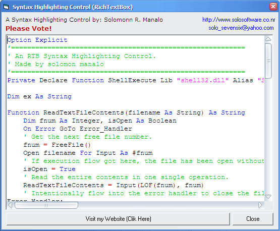



## A Fast RichTextBox Syntax Colouring by: SOLOSoftware

### Description

A FAST SYNTAX COLOURING LIKE NO OTHER....PLEASE VOTE!!!!! This usercontrol focuses on syntax colouring like in VB/C++/Delphi and Etc. It has a beginner friendly Properties, and Mehods that other syntax coloring control do not have. Although this is not fully commented you will understand how it works, easily. /PLEASE/ if there's any chance that you can upgrade this usercontrol please tell me (solo_sevensix@yahoo.com) and send me comments.

Thanks.. PLEASE VOTE!!!!!!!!!!!!
 
### More Info
 
HTML TAGS not Supported

             |
---                |---
**Submitted On**   |2007-04-17 01:01:44
**By**             |[Solomon Reyes Manalo](https://github.com/Planet-Source-Code/PSCIndex/blob/master/ByAuthor/solomon-reyes-manalo.md)
**Level**          |Advanced
**User Rating**    |4.7 (14 globes from 3 users)
**Compatibility**  |VB 5\.0, VB 6\.0, VBA MS Access, VBA MS Excel
**Category**       |[Custom Controls/ Forms/  Menus](https://github.com/Planet-Source-Code/PSCIndex/blob/master/ByCategory/custom-controls-forms-menus__1-4.md)
**World**          |[Visual Basic](https://github.com/Planet-Source-Code/PSCIndex/blob/master/ByWorld/visual-basic.md)
**Archive File**   |[A\_Fast\_Ric2064945102007\.zip](https://github.com/Planet-Source-Code/solomon-reyes-manalo-a-fast-richtextbox-syntax-colouring-by-solosoftware__1-68557/archive/master.zip)

